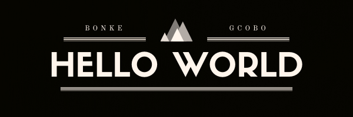

## Available For Hire

I am Bonke Gcobo, currently student at Microverse, I am in a journey to Full Stack Web-Developer, welcome to my github profile.

## Visit Counters

Email : bonkegcobo291195@gmail.com

## 🔭  I’m currently working on 
Currently working on a leaderboard app, we will use the leaderboard api to do this.

## 🌱 I’m currently learning  
Currently in my journey to be a full stack web developer, at the moment I am ruby and databases

## 👯 I’m looking to collaborate on 
I am willing to collaborate on projects which are done with JS, as a way to consolidate my js knowledge and building a wider network with other developers.
Edutech Ethusiast, I am always game for any solutions that will improve the way we recieve education in our society.

## 📫 How to reach me:
GitHub: [@githubhandle](https://github.com/BonkeGcobo)

Twitter: [@twitterhandle](https://twitter.com/bonke_gcobo)

LinkedIn: [LinkedIn](https://www.linkedin.com/in/bonke-gcobo-28a763125/)

### 😄 Pronouns: (HE, HIM)

### ⚡ Fun fact: I think better after a cup of coffee, and a chocolate Muffin 😄

